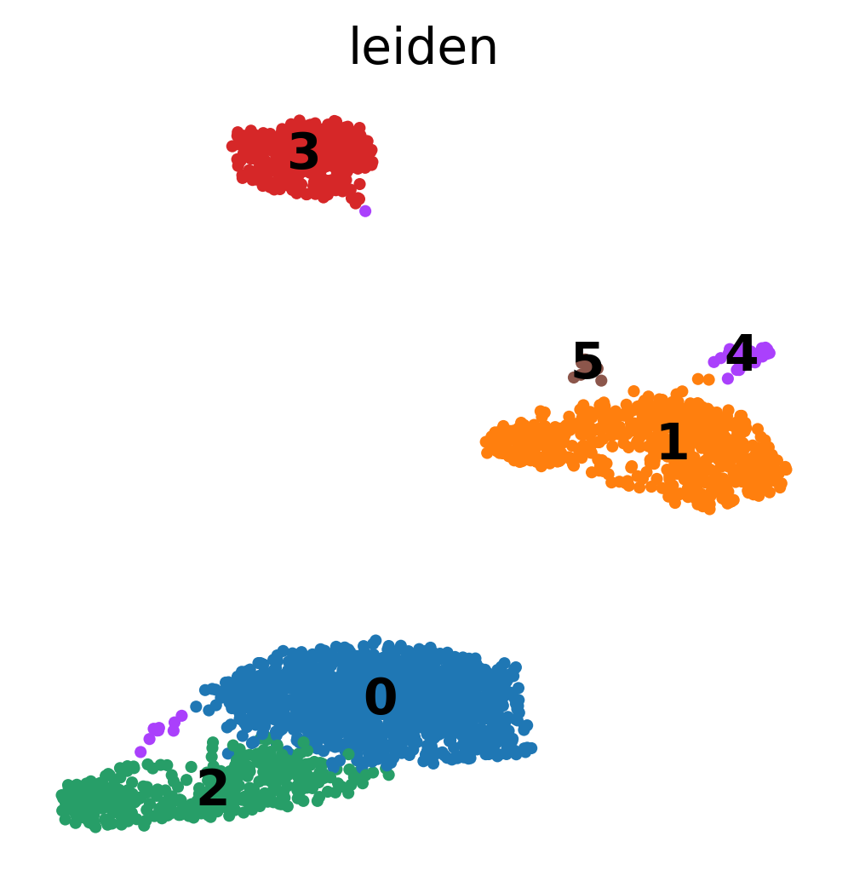
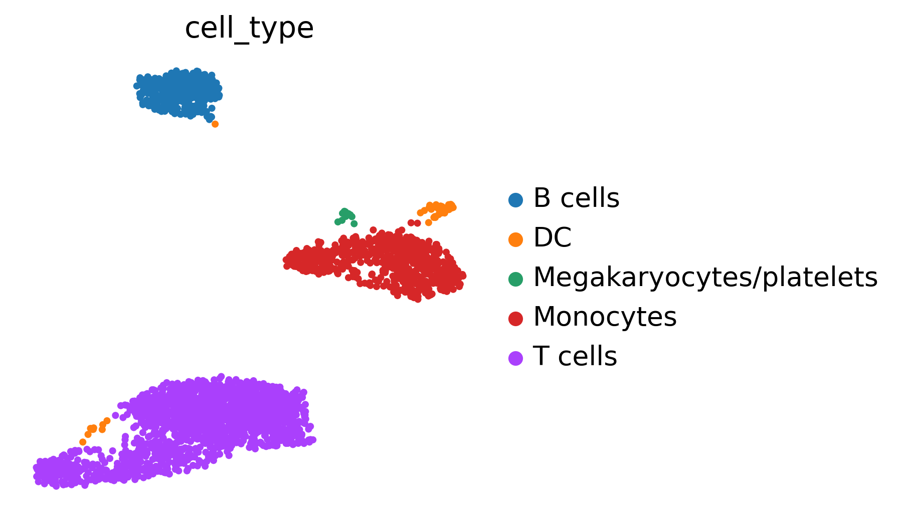
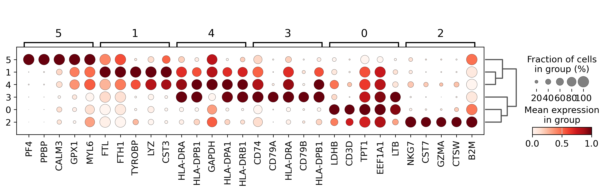
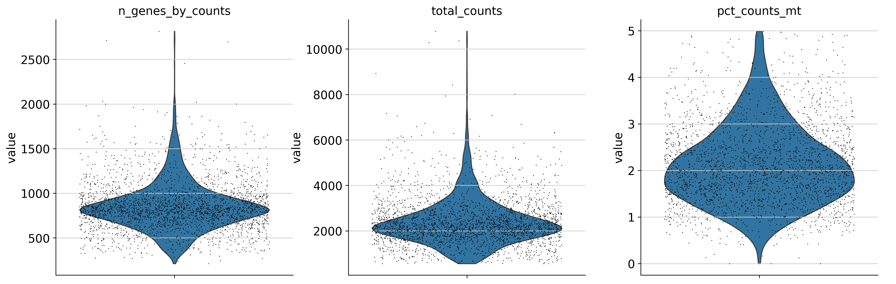

# scrnaseq-pipeline


A fully reproducible single-cell RNA-seq analysis pipeline, from raw data to
biological interpretation, built with **Snakemake 8** and **Scanpy**. The
workflow analyses the public **10x Genomics PBMC 3k** dataset (v3 chemistry)
and produces a complete, client-ready report: quality control, preprocessing,
doublet detection, clustering, automated cell-type annotation and marker gene
identification.

## Overview

Peripheral blood mononuclear cells (PBMCs) are the standard benchmark system
for single-cell transcriptomics: they mix well-characterised immune
populations (T cells, B cells, NK cells, monocytes, dendritic cells) whose
identity must be recovered *de novo* from gene expression alone. This project
demonstrates an end-to-end, production-grade analysis of ~2,700 PBMCs —
the kind of deliverable expected in a clinical or research bioinformatics
setting — with every step versioned, containerised by conda, and re-runnable
with a single command.

## Dataset

| Property | Value |
|---|---|
| Source | [10x Genomics — 3k PBMCs from a healthy donor](https://www.10xgenomics.com/datasets/3-k-pbm-cs-from-a-healthy-donor-1-standard-1-1-0) |
| Technology | Chromium Single Cell 3′, v3 chemistry |
| Cells | ~2,700 (after filtering) |
| Reference | hg19 (Cell Ranger filtered matrix) |

The dataset is intentionally small: the full pipeline runs on a **laptop with
16 GB of RAM** in minutes. No raw data is committed to this repository; the
download script fetches everything from the official 10x Genomics servers.

## Pipeline

1. **Data download & read QC** — fetch the filtered matrix and raw FASTQ
   files; FastQC + MultiQC on the reads.
2. **Preprocessing** — cell/gene filtering (detected genes, total counts,
   mitochondrial fraction), count normalisation, highly variable gene
   selection, PCA.
3. **Doublet detection** — Scrublet with an expected doublet rate of 6%.
4. **Clustering & visualisation** — Leiden clustering on the neighbourhood
   graph, UMAP embedding.
5. **Cell-type annotation** — CellTypist (`Immune_All_High` model) with
   majority voting per cluster.
6. **Marker genes** — per-cluster differential expression
   (`rank_genes_groups`, Wilcoxon), exported with log fold-changes and
   adjusted p-values.
7. **Final report** — an auto-generated `report/report.md` embedding all
   figures and a written biological interpretation of the identified
   populations.

> Read alignment and UMI counting (Cell Ranger) are **out of scope**: the
> analysis starts from the official Cell Ranger filtered gene-barcode matrix.
> Raw FASTQ files are used only for read-level QC (step 1).

## Quickstart

Requirements: `git`, `bash`, and [conda/mamba](https://docs.conda.io/) with
Snakemake 8 available (`conda install -c conda-forge -c bioconda snakemake=8`).

```bash
git clone https://github.com/mounemhf/pipeline-d-analyse-RNA-seq-ou-scRNA-seq-complet.git
cd pipeline-d-analyse-RNA-seq-ou-scRNA-seq-complet

# 1. Download the data (matrix ~28 MB; add --with-fastq for read-level QC, ~4.5 GB)
bash data/download_data.sh --with-fastq

# 2. Run the full pipeline
snakemake --use-conda --cores 4
```

The final report is written to `report/report.md`.

## Repository structure

```
scrnaseq-pipeline/
├── config/
│   └── config.yaml          # every path and parameter (no hardcoded paths)
├── data/
│   └── download_data.sh     # fetches matrix + FASTQ from 10x Genomics
├── workflow/
│   ├── Snakefile
│   ├── rules/               # qc, preprocess, cluster, annotate, report (.smk)
│   ├── scripts/             # one argparse Python script per analysis step
│   └── envs/                # one pinned conda environment per step
├── notebooks/               # exploratory notebooks only
├── results/                 # generated (figures, tables, logs)
├── report/                  # generated final report (report.md)
├── CITATION.cff
└── LICENSE                  # MIT
```

## Results

The full deliverable is the auto-generated
[`report/report.md`](report/report.md), which embeds every figure together
with a written biological interpretation of the identified PBMC populations.
All figures are produced at 300 dpi with publication-ready styling; the final
figures and the report are committed so this page renders standalone, while
raw data and intermediate results are regenerated on demand.

| Leiden clusters | CellTypist annotation |
|---|---|
|  |  |

| Marker genes | QC after filtering |
|---|---|
|  |  |

## Reproducibility

- Every Snakemake rule runs in its own **pinned conda environment**
  (`workflow/envs/`, no floating versions).
- All parameters live in `config/config.yaml`; the random seed is fixed.
- One log file per rule under `results/logs/`.
- Key versions: Python 3.11, Scanpy 1.10.4, Scrublet 0.2.3, CellTypist 1.6.3,
  leidenalg 0.10.2, FastQC 0.12.1, MultiQC 1.25.1.

## Citation

If you use this pipeline, please cite it via the metadata in
[`CITATION.cff`](CITATION.cff), along with the underlying tools and the
10x Genomics dataset.

## License

This project is released under the [MIT License](LICENSE).

## Author

Leona — MSc Bioinformatics. Feedback and contributions are welcome via issues.
