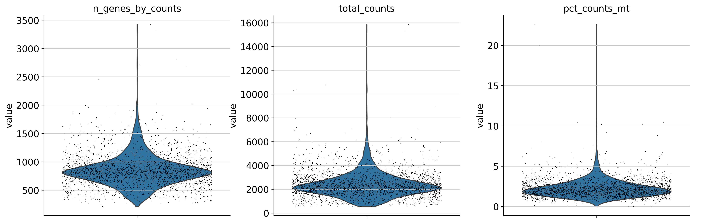
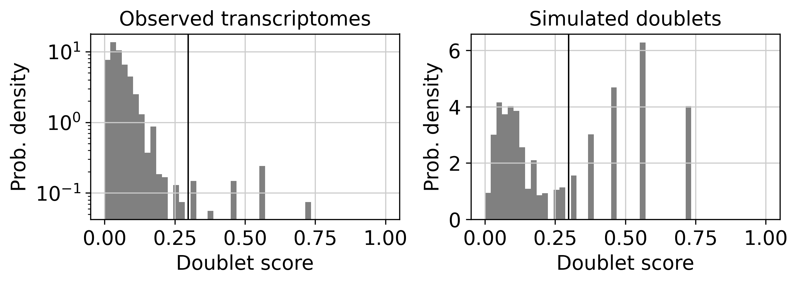
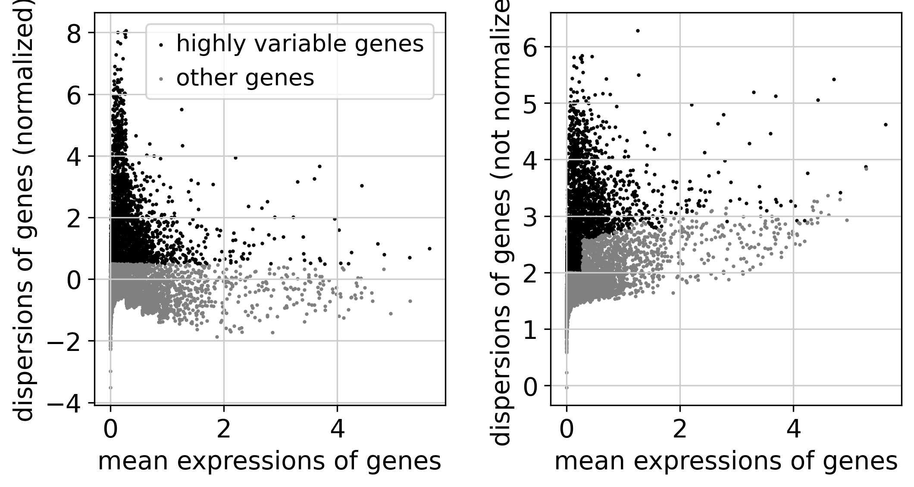
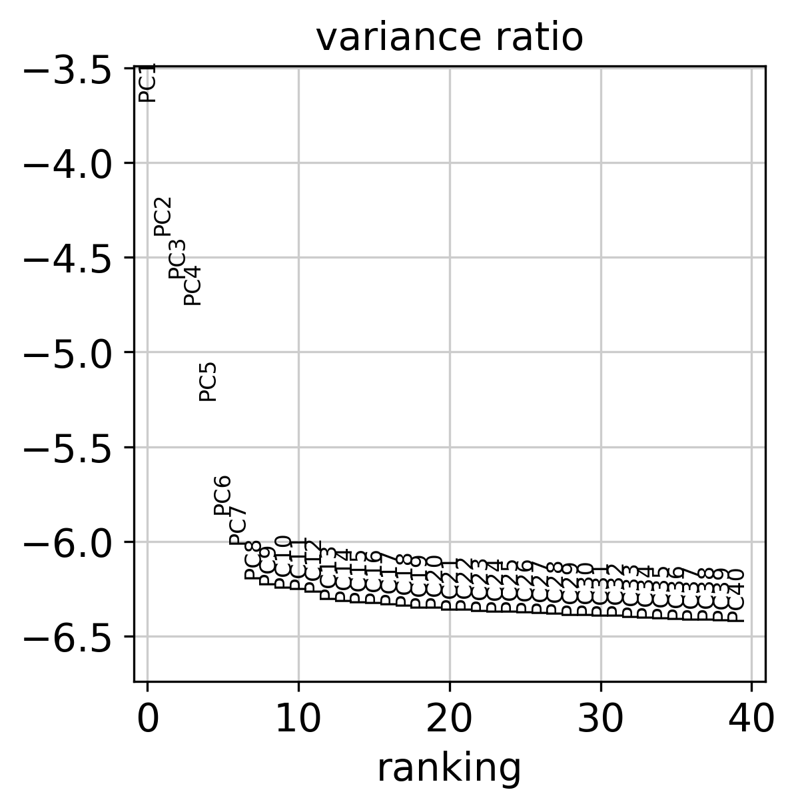

# Single-cell RNA-seq analysis report — 10x Genomics PBMC 3k (v3 chemistry)

*Generated on 2026-10-01 by the Snakemake pipeline
(`snakemake --use-conda --cores 4`). All parameters are defined in
`config/config.yaml`.*

## 1. Read and cell quality control

Read-level QC (FastQC/MultiQC) is available under `results/qc/` when the raw
FASTQ files are downloaded. At the cell level, 2700 barcoded
cells x 32738 genes were reduced to 2641 cells x
13714 genes after filtering on detected genes, total
counts and mitochondrial fraction (thresholds below).

### Pipeline parameters

| parameter | value |
|---|---|
| min genes / cell | 200 |
| min cells / gene | 3 |
| max % mitochondrial | 5.0 |
| max total counts | 15000.0 |
| highly variable genes | 2000 |
| principal components | 40 |
| neighbours | 10 |
| Leiden resolution | 0.5 |
| expected doublet rate | 0.06 |
| CellTypist model | Immune_All_High.pkl |
| random seed | 42 |

## 2. Doublet detection

Scrublet predicted **36 doublets**, which were
removed before clustering.

## 3. Clustering and embedding

Leiden clustering resolved **6 clusters** across
2605 cells.

## 4. Cell-type annotation

Automated annotation with CellTypist (`Immune_All_High.pkl`, majority voting over
Leiden clusters):

| cell type | cells | fraction |
|---|---|---|
| T cells | 1594 | 61.2% |
| Monocytes | 625 | 24.0% |
| B cells | 331 | 12.7% |
| DC | 40 | 1.5% |
| Megakaryocytes/platelets | 15 | 0.6% |

## 5. Marker genes

Per-cluster differential expression (`rank_genes_groups`, Wilcoxon). Full
statistics — including log fold-changes and adjusted p-values — are in
`results/tables/marker_genes_all.csv`.

| cluster | cell type | top 5 markers |
|---|---|---|
| 0 | T cells | LDHB, CD3D, TPT1, EEF1A1, LTB |
| 1 | Monocytes | FTL, FTH1, TYROBP, LYZ, CST3 |
| 2 | T cells | NKG7, CST7, GZMA, CTSW, B2M |
| 3 | B cells | CD74, CD79A, HLA-DRA, CD79B, HLA-DPB1 |
| 4 | DC | HLA-DRA, HLA-DPB1, GAPDH, HLA-DPA1, HLA-DRB1 |
| 5 | Megakaryocytes/platelets | PF4, PPBP, CALM3, GPX1, MYL6 |

## 6. Biological interpretation

Starting from 2700 barcoded cells, quality filtering retained 2641 high-quality cells with a median of 820 detected genes per cell. Scrublet flagged 36 predicted doublets (1.4%), well below the configured expected rate of 6% — Scrublet's automatic threshold was conservative. Leiden clustering of the remaining 2605 cells resolved 6 transcriptionally distinct clusters, which CellTypist (Immune_All_High.pkl) assigned to the expected PBMC lineages.

**T cells** (1594 cells) were recovered in cluster 0 (T cells, 1176 cells); cluster 2 (T cells, 418 cells). Top marker genes for these clusters include LDHB, CD3D, TPT1, NKG7, CST7, GZMA. The canonical lineage markers CD3D are among the strongest differentially expressed genes, confirming the automated annotation. T lymphocytes are expected to form the largest PBMC fraction (typically 50-70%), and their dominance here is consistent with a healthy donor profile. Caution: the top markers here are dominated by NK cells-associated genes (NKG7, CST7, GZMA), so the automated label likely lumps or misassigns this population; manual curation is recommended before any biological claim.

**B cells** (331 cells) were recovered in cluster 3 (B cells, 331 cells). Top marker genes for these clusters include CD74, CD79A, HLA-DRA. The canonical lineage markers CD79A are among the strongest differentially expressed genes, confirming the automated annotation. B cells form the humoral arm of adaptive immunity and usually account for 5-10% of PBMCs.

**Monocytes** (625 cells) were recovered in cluster 1 (Monocytes, 625 cells). Top marker genes for these clusters include FTL, FTH1, TYROBP. Monocytes are the main circulating myeloid population (10-20% of PBMCs).

**Dendritic cells** (40 cells) were recovered in cluster 4 (DC, 40 cells). Top marker genes for these clusters include HLA-DRA, HLA-DPB1, GAPDH. Dendritic cells are rare in peripheral blood (<2%) and surface here as small, well-separated clusters.

**Megakaryocytes / platelets** (15 cells) were recovered in cluster 5 (Megakaryocytes/platelets, 15 cells). Top marker genes for these clusters include PF4, PPBP, CALM3. The canonical lineage markers PPBP, PF4 are among the strongest differentially expressed genes, confirming the automated annotation. A small megakaryocyte/platelet signal is a common finding in PBMC preparations and reflects residual platelet contamination rather than a blood-resident population.

Overall, the recovered composition — T cells (61.2%), Monocytes (24.0%), B cells (12.7%) as the three largest populations — matches the expected makeup of peripheral blood from a healthy donor, and cluster-resolved marker genes are largely concordant with the reference-based CellTypist labels, with the exceptions flagged above. Two caveats apply: this is a single-donor, single-batch dataset, so no batch integration was required (with multiple samples, Harmony or scVI integration would precede clustering); and automated annotation is only as granular as its reference — rare subsets such as dendritic cell flavours would benefit from manual marker-based curation before any downstream biological claim.

